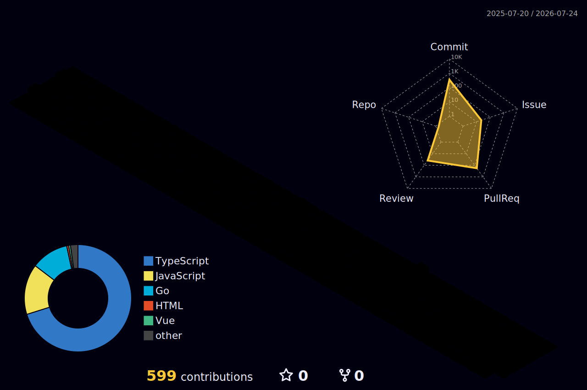

  

  

  

  🎯 Software Developer at Nethesis &nbsp;|&nbsp; 📍 Pesaro, Italy 
  🧠 Passionate about open source, VoIP and frontend development 
  🎬 Marvel Cinematic Universe fan

---

## 🛠️ Tech Stack

**Languages**

**Frontend**

**Backend & Realtime**

**Tools**

---

## 🚀 Featured Projects

### 📞 [phone-island](https://github.com/nethesis/phone-island)

Standalone React component to handle calls, video calls, screen sharing and chat.

### 💻 [nethvoice-cti](https://github.com/nethesis/nethvoice-cti)

Web CTI client for NethVoice, built with Next.js, React and Tailwind.

---

## 🧊 Contribution Calendar (3D)

  

---

## 🐍 Watch the snake eat my contributions

  

---

## 📊 GitHub Metrics

  

  
   
  

---

## 📫 Contact

  
  
  

